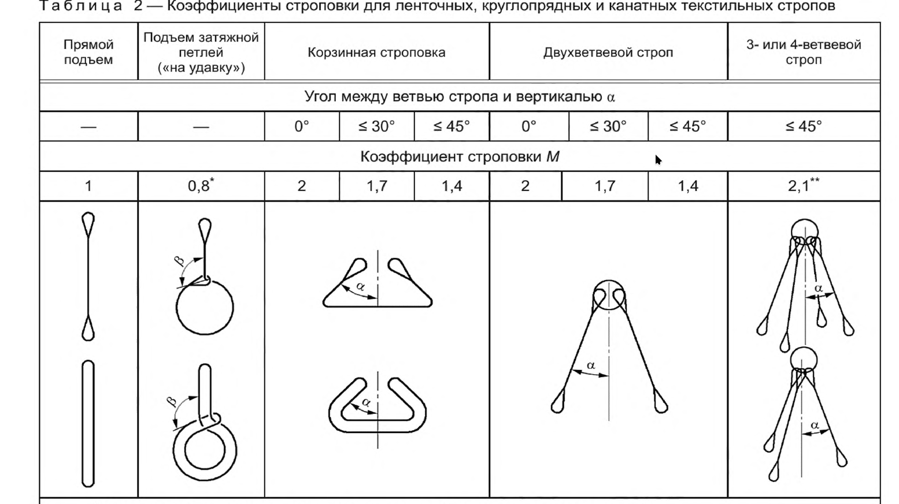
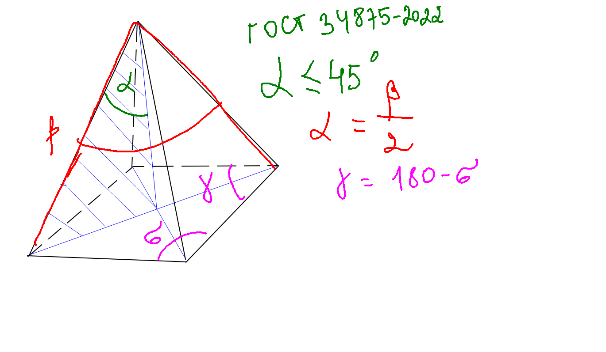

# Создание прогнозной модели для детектирования угла расхождения строп при погрузочных работах
*Задание выполнено в рамках хакатона цифровой кафедры МФТИ, от партнера хакатона ООО «Газпромнефть - ЦР»* 1

#### Задание выполнила команда М87 в составе:  
* [Алексей Сейкин](https://github.com/immelstorun) 
* [Дарья Курочкина](https://github.com/DariaShvetsova)
* Виктория Белова
* Таисья Щеглова
* Алексей Осипов
* Маргарита Зиновеева

#### Датасет
В директории /data

## Описание задачи

Компания Газпромнефть Цифровые решения занимается обеспечением цифровизацией и обечпечением ИТ-потребностей ПАО Газпром Нефть. В большинстве дочерних предприятий , связанных с производством
применяются краны для погрузо-разгрузочных работ (ПРР). Данные работы сопряжены с высоким риском для жизни и здоровья людей, а также сохранности целостности груза и техники. Поэтому очень важно
выполнять ПРР с безукоризненным соблюдением правил промышленной безопасности.

## Проблема

Один из параметров, требующий контроля, это правильность строповки – то есть то как закреплен груз стропами. При ППР с длинномерным грузом угол расхождения строп должен быть менее 90 градусов.

## Необходимая и доступная для решения информация 

1. Видеофайлы демонстрирующие погрузочные работы. Камеры находятся на целевых ракурсах.
2. Консультация с экспертами. На консультации будет предложен общий подход к решению, ответы на вопросы.

## Желаемый результат

MVP с функционалом:
1. Принимает изображение (фото погрузки)
2. Оценивает угол между строп
3. Выдает результат измерения
4. Треккинг и расчет угла в движении и повороте груза * Опционально

## Перспективы развития проекта

В дальнейшем данный модуль будет встроен в автономный ПАК на кране и будет предупреждать о возникающих нарушениях при ПРР.

## Ход решения

# Обоснование решения

Согласно ГОСТ 34875—2022 на строповку, при применении 4х ветвевого стропа угол между ветвью стропа и вертикалью пирамиды должен быть меньше или равен 45 градусам. 

Стропы вместе с крышей груза формируют четырехгранную пирамиду. 
Для решения задачи (и, следовательно, для детекции) нам нужны углы бета и гамма на кадре. Остальные углы рассчитываются из данных двух.

** в будущем при доработке для решения проблемы поворота груза в пространстве для переноса будут использованы углы Эйлера.
В рамках одного кадра разметки будут рассчитаны углы для основания пирамиды, и, зная, что в реальности основание пирамиды - прямоугольник, у которого каждый угол равен 90 градусов, можно будет рассчитать поворот. Зная поворот и зная угол расхождения строп на кадре, можно рассчитать реальный угол расхождения строп.

Когда стропы натянуты, искомый угол не меняется, поэтому не имеет значения в какой момент видео его детектить для обучения модели.

# Шаги решения

1. Загрузка партнерского видео и загрузка аналогичных видео из открытых источников для дообучения модели.
   
3. Нарезка видео на кадры для удобства разметки. Ориентировочное суммарное количество кадров для обучения модели около 400. (200 шт - газпром и 200 из публичных источников)
   
5. Разметка в программе ROBOFLOW. Будет использована разметка keypoints, чтобы далее зная координаты точек можно было вычислить угол на кадре. 

7. Выгрузка разметки из ROBOFLOW в формате YOLO8 , совмещение с фотосетом.

8. Добучение модели YOLOv8 pose, предобученной на детекции поз человека, размеченным нами датасетом, для детекции вершин условной пирамиды

9. Рассчет искомых углов по схеме: 
- По координатам точек вычисляли вектора, составляющие угол
- Через скалярное произведение векторов вычисляли сам угол
- Вычислялся видимый угол на плоскости

10. Отображение углов на фото, с подписью реального угла расхождения строп.
*в перспективе планируется детектить угол на видео и выводить предупреждение если угол расхождения строп более 90 градусов.

# Результат:
1. Обучена модель YOLOv8 Keypoint Detection 
2. Модель распознает угол на фото и отображает цифрой на фото 
3. Над точностью надо поработать ;)
